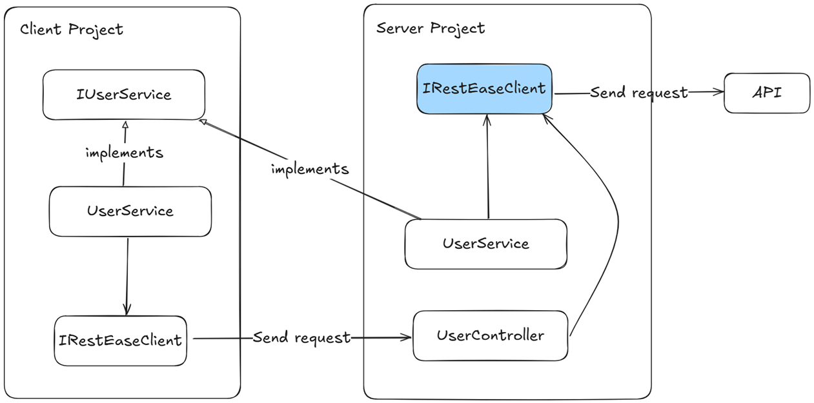

# Introduction

BlazorAutoBridge is a source generator that produces all the necessary code for making external API calls in a Blazor Auto Render Mode application.
It eliminates repetitive and error-prone boilerplate, allowing developers to focus on business logic rather than plumbing code.

# Architecture Overview

In Blazor Auto Render Mode, all external API calls made from the WebAssembly client are routed through an internal API hosted on the server.
The internal API then forwards the request to the actual external API.
This approach is illustrated in the diagram below:




# Getting Started

## Install NuGet Package
Add the NuGet package to both the Client and Server projects:

```bash
Install-Package BlazorAutoBridge -Version 1.0.0
```

Add these Nuget packages to the Client project:
```bash
Install-Package RestEase -Version 1.6.4
Install-Package RestEase.HttpClientFactory -Version 1.6.4
```

## Define RestEase API Interfaces 
Create your API interfaces that describe the endpoints you want to call using `RestEase`.
These interfaces will be used by the source generator to create the implementation code.
These interfaces must be defined in both the Client and Server projects, as they are used to generate the necessary code for API calls.

For example, create a file named `IUserService.cs` in both Client and Server projects:
```csharp
[ApiService] // marker Attribute
public interface IUserApi
{
	[Get("users")]
	Task<IEnumerable<UserDto>> GetAllUsersAsync();
}
```

## Client Project Setup
In the Client project's `Program.cs`:

```csharp
using BlazorAutoBridge.DependencyInjection;

builder.Services.AddBlazorAutoBridge((sp, client) =>
{
	client.BaseAddress = new Uri($"{builder.HostEnvironment.BaseAddress}forwarders"); // don't change this
	client.Timeout = TimeSpan.FromSeconds(5);
});
```

## Server Project Setup
In the Server project's `Program.cs`:

```csharp
using BlazorAutoBridge.DependencyInjection;

builder.Services.AddBlazorAutoBridge((sp, client) =>
{
	client.BaseAddress = new Uri("https://localhost:7005/api/");
	client.Timeout = TimeSpan.FromSeconds(5);
});

var app = builder.Build();

// ...

app.MapControllers(); // Don't forget to add this line

app.Run();
```

## Using Generated Services in Blazor Components
You can now inject your generated services in your Blazor components:

```razor
@inject IUserService UserService

<button @onclick="LoadUsers">Load Users</button>

@code {
	private async Task LoadUsers()
	{
		var users = await UserService.GetAllUsersAsync();
		// Handle result
	}
}
```
